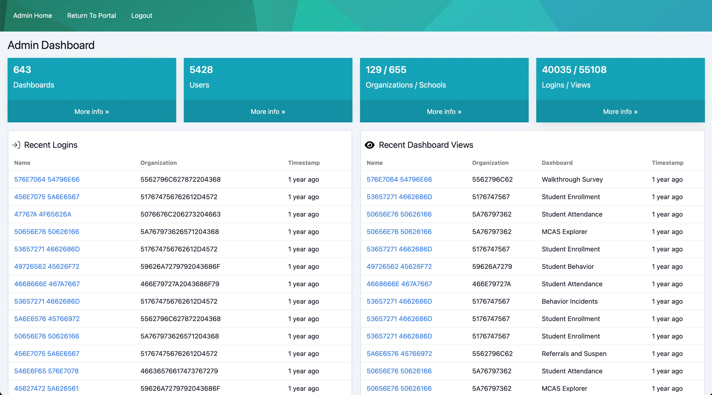

# Open Architects

## Solution Notes

- uses [htmx](//htmx.org/) for dynamically showing data.
- uses tailwind, specifially [daisyui](https://daisyui.com/) for styling application components.
- see `templates/data` directory for HTMX components. uses Jinja2 macros etc.

## Finished App screenshot

### Full Stack Python Web Developer Hiring Assigment

This hiring assignment is designed to evaluate your full-stack web development skills and experience, focusing on how they directly correspond to our environment, tech stack, and the day-to-day work we perform. This repository contains a starter Flask project paired with an attached SQLite database. We've already connected the Flask project to the SQL database and constructed the ORM. Additionally, you will find a link below to a Figma project showcasing a version of our admin homepage. This modified and condensed rendition of the admin homepage functions as the landing page for both OA staff and select school district leaders, offering valuable insights and statistics.

#### Your Task
Your task is to use the Flask project and the Figma mock-up to create the admin homepage.

* In consideration of your time, we're not seeking a pixel-perfect recreation of the admin homepage. However, we'd like it to be as close as possible.
* Page load time is a top concern due to the amount of data wrangling required. We recommend loading the HTML page and utilizing JS (vanilla, HTMX, or another method) to call endpoints you create to asyncronously retrieve the data needed to render the page. Your endpoints should look something like this
  * / - admin homepage
  * /data/cards - JS endpoint for the four data cards at the top
  * /data/logins - JS endpoint for the recent logins table
  * /data/views - JS endpoint for the recent dashboard views

**Time Expectation:** 5-8 hours

#### Installing the Project
1. Clone or unzip the project to a folder of your choice and `cd` into the folder
2. Unzip app.zip to app.db (it should be in the same folder as `__init__.py`)
3. Build the Docker image `docker build -t oa-hiring-webdev .`
4. Create a volume for persistence between working sessions `docker volume create webdev_data`
5. Run the Docker container `docker run -d --name oa-hiring-webdev -v webdev_data:/app -p 80:80 oa-hiring-webdev`
6. The project should now be running and exposed on `127.0.0.1` (port 80)

#### Assets
1. Figma link: `https://www.figma.com/file/Ja88z8K1bKeqSnpc0j0AcK/OA-Full-Stack-Developer-Assignment?type=design&node-id=0%3A1&mode=design&t=SUEsNLZrIwlRoxYs-1` password: `immutable-thorough-ultramarine-function`
2. There is a `banner-bar.png` located `/app/static/images`
3. Us! Please ask us for help if you need clarification on what we're looking for or anything else.

#### Deliverables
* An archive file of your webdev_data volume or any other method that's easy for us to deploy on our end.

#### Notes
* ⚠ The data shown in Figma will not align with what's in the database (e.g. user, login, view, etc. counts). The database in this project is old.
